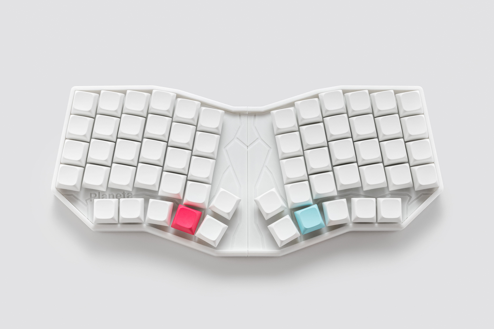

## Planeta is an ergonomic mechanical keyboard with split design for more comfortable typing

### This repo contains all files related to this keyboard
PCB and schematic can be found [here](https://oshwlab.com/yuriiq/planeta_copy)

## License 

The files in this repository are licensed under a Creative Commons Attribution-NonCommercial-ShareAlike 4.0 International License.

## Firmware
- [Pre-compiled files][1]
- [Source code][2]

[1]: https://github.com/ergohaven/keymap_hub
[2]: https://github.com/ergohaven/vial-qmk/tree/vial/keyboards/ergohaven
