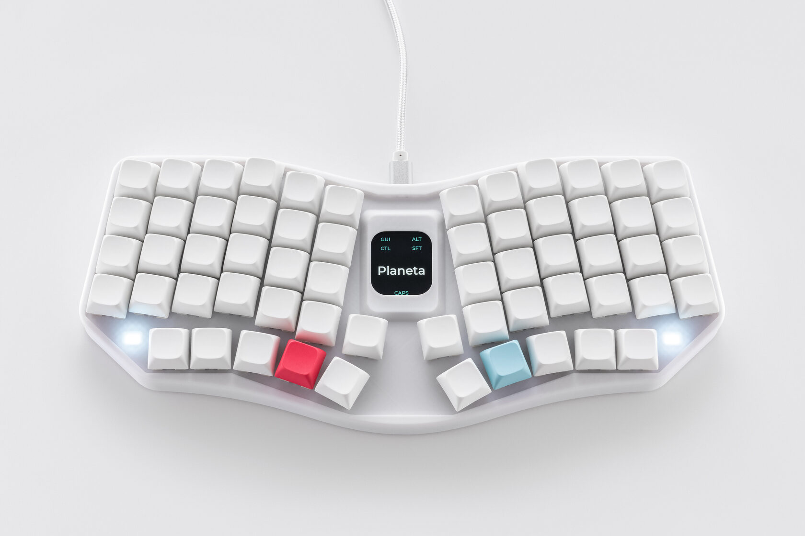
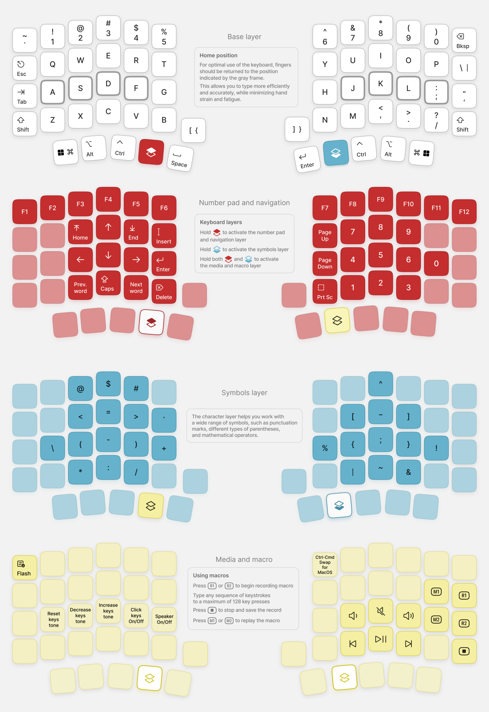

## Planeta is an ergonomic mechanical keyboard with split design for more comfortable typing

*Planeta keeps a 60% footprint, a 60-key layout, and clean ergonomics*

## Design philosophy
Planeta combines futuristic styling, a compact form factor, and practical ergonomics

## Features
- Ergonomic design
- 60 fully programmable keys and 15 additional layers for all your tasks
- Hot-swappable PCB (MX sockets)
- Powered by RP2040 and QMK firmware
- Easily remap any key and customize your keyboard with [Vial](https://eh.industries/vial)
- IPS display and active-layer indicator

## This repository contains all files related to this keyboard
PCB and schematic can be found [here](https://oshwlab.com/yuriiq/planeta_v2)

### BOM

| Components | Quantity (pcs) |
| --- | ---: |
| Planeta v2 PCB | 1 |
| Raspberry Pi Pico Board RP2040 2MB MCU | 1 |
| MX hotswap sockets | 60 |
| 1N4007W diodes, SOD-123 | 60 |
| 1.69" LCD IPS, ST7789, 240x280, with SPI Interface | 1 |
| Resistor 0805 1 kΩ | 1 |
| SK6803MINI-E-001, SMD LED | 2 |
| PKLCS1212E4001-R1, SMD Buzzer | 1 |

## License
The files in this repository are licensed under the Creative Commons Attribution-NonCommercial-ShareAlike 4.0 International License

## Useful links

- Planeta v2:
  - [Case for 3D printing (STL)](stls/planeta-v2)
  - [Case model for editing (STEP)](step/planeta-v2)
  - [Circuit schematic](https://oshwlab.com/yuriiq/planeta_v2)

### Firmware
- [Pre-compiled files](https://github.com/ergohaven/keymap_hub)
- [QMK source code](https://github.com/ergohaven/vial-qmk)

## Availability
The complete keyboard (not a DIY kit) is available for purchase at [eh.industries](https://eh.industries/)
